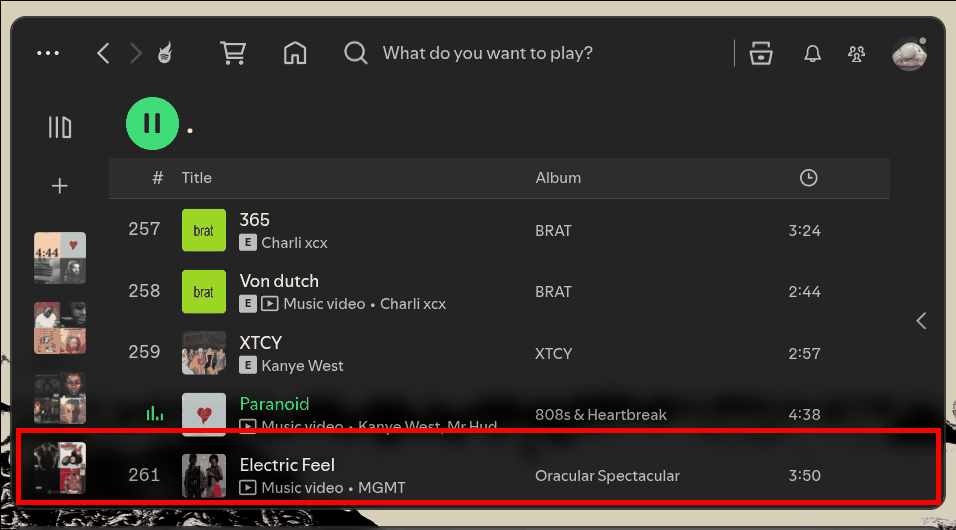
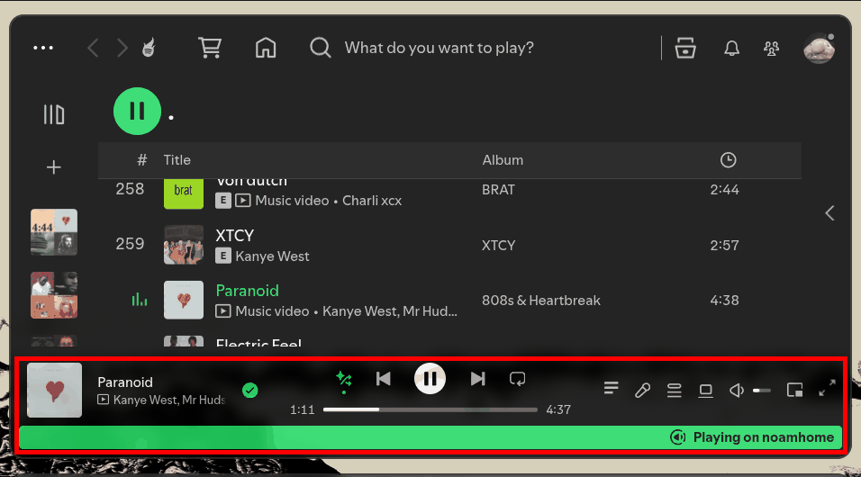

# Tiled Window Fix

Keeps Spotify's now-playing bar on screen when the window is small, like in Hyprland or another tiling window manager.

Spotify sets a minimum window size of 800x600. If your tiling layout gives it less height than that, Spotify still draws at 600px and the now-playing bar at the bottom gets cut off. This extension removes that minimum, so the main view shrinks and the bar stays visible.

## Before / after

## Install

Install it from the Spicetify Marketplace, or manually:

1. Copy `tiled-window-fix.js` into your Spicetify `Extensions` folder.
2. Run `spicetify config extensions tiled-window-fix.js`
3. Run `spicetify apply`
